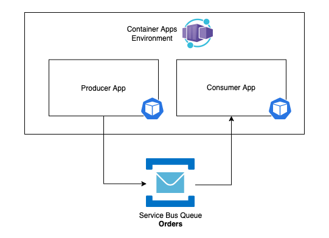

# About this project
Scale Container Apps application based on events. This example uses the size of a Service Bus queue as a scaling trigger.

Currently using ```azapi_resource``` to create the Container Apps resources since there's no module in terraform as of now.

## Architecture 



## Usage

### Create the Container Registry using ```terraform```

```
$ cd terraform
$ az login
$ terraform init
$ terraform plan -var 'order-app=<resource_group_name>' -target azurerm_container_registry.order-app
$ terraform apply -target azurerm_container_registry.order-app
```

### Build the order-app images using ACR Tasks

```
cd apps/order-consumer
az acr build -r <acr_name> --image order-consumer:v1 .
cd apps/order-producer
az acr build -r <acr_name> --image order-producer:v1 .

```

### Deploy remaining resources using ```terraform```

```
$ cd terraform
$ terraform plan -var 'order-app=<resource_group_name>'
$ terraform apply
```

### Watch the Consumer App replica count increase as messages are produced by the Producer App (```az containerapp replica list``` takes a while to reflect the actual count)

```
$ az containerapp replica list --name order-consumer --resource-group <resource_group> -o table
$ az servicebus queue show --resource-group <resource_group> --namespace-name <servicebus_namespace> --name orders -o table --query 'messageCount
```

### Remove the Producer App and watch the Consumer scale to zero
```
$ cd terraform
$ terraform destroy -target azapi_resource.order-producer
$ az containerapp replica list --name order-consumer --resource-group <resource_group> -o table
```
